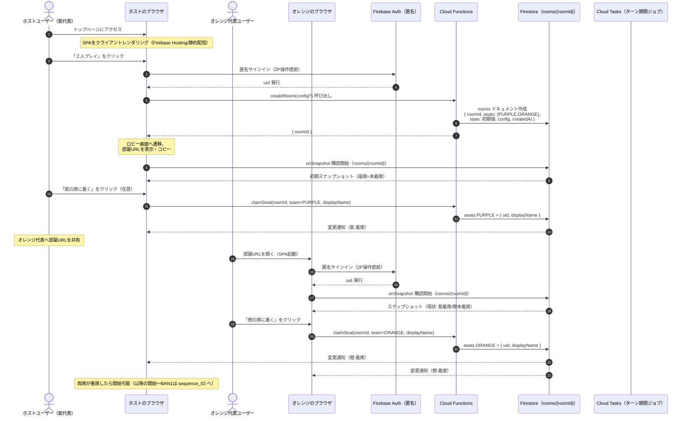

```mermaid
sequenceDiagram
    autonumber
    actor Host as ホストユーザー（紫代表）
    participant HostClient as ホストのブラウザ
    actor Orange as オレンジ代表ユーザー
    participant OrangeClient as オレンジのブラウザ
    participant Auth as Firebase Auth（匿名）
    participant Func as Cloud Functions
    participant DB as Firestore（rooms/{roomId}）
    participant Tasks as Cloud Tasks（ターン期限ジョブ）

    Host->>HostClient: トップページにアクセス
    Note over HostClient: SPAをクライアントレンダリング（Firebase Hosting/静的配信）

    Host->>HostClient: 「２人プレイ」をクリック
    HostClient->>Auth: 匿名サインイン（2P操作直前）
    Auth-->>HostClient: uid 発行
    HostClient->>Func: createRoom(config?) 呼び出し
    Func->>DB: rooms ドキュメント作成<br />{ roomId, seats: {PURPLE,ORANGE},<br />  state: 初期値, config, createdAt }
    Func-->>HostClient: { roomId }
    Note over HostClient: ロビー画面へ遷移。<br />部屋URLを表示・コピー

    HostClient->>DB: onSnapshot 購読開始（rooms/{roomId}）
    DB-->>HostClient: 初期スナップショット（座席=未着席）

    Host->>HostClient: 「紫の席に着く」をクリック（任意）
    HostClient->>Func: claimSeat(roomId, team=PURPLE, displayName)
    Func->>DB: seats.PURPLE = { uid, displayName }
    DB-->>HostClient: 変更通知（紫:着席）

    Note over Host: オレンジ代表へ部屋URLを共有

    Orange->>OrangeClient: 部屋URLを開く（SPA起動）
    OrangeClient->>Auth: 匿名サインイン（2P操作直前）
    Auth-->>OrangeClient: uid 発行
    OrangeClient->>DB: onSnapshot 購読開始（rooms/{roomId}）
    DB-->>OrangeClient: スナップショット（現状: 紫着席/橙未着席）

    Orange->>OrangeClient: 「橙の席に着く」をクリック
    OrangeClient->>Func: claimSeat(roomId, team=ORANGE, displayName)
    Func->>DB: seats.ORANGE = { uid, displayName }
    DB-->>HostClient: 変更通知（橙:着席）
    DB-->>OrangeClient: 変更通知（橙:着席）

    Note over HostClient: 両席が着席したら開始可能（以降の開始〜BAN1は sequence_02 へ）
```
