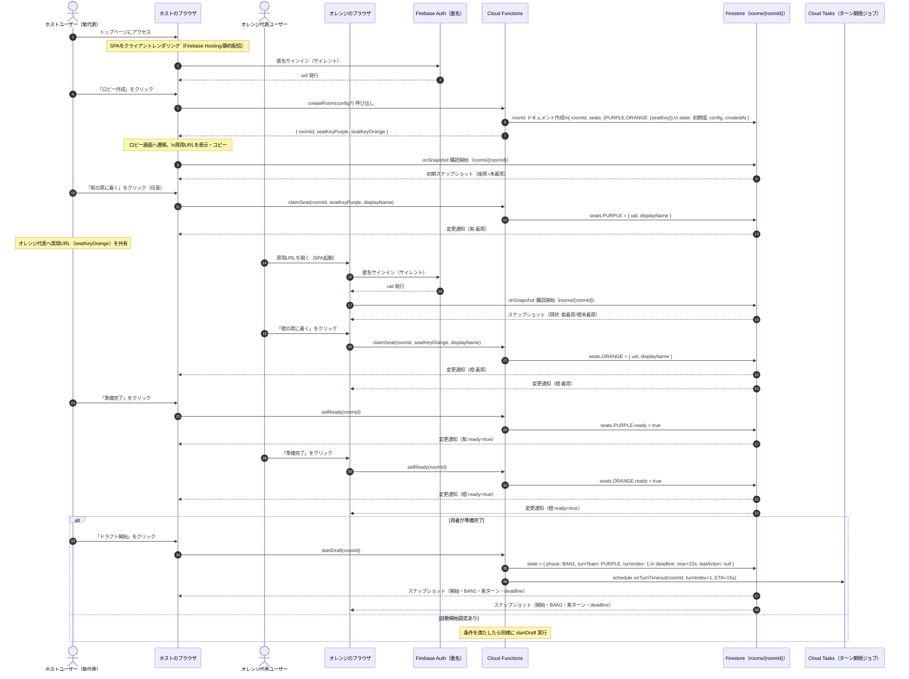

```mermaid
sequenceDiagram
    autonumber
    actor Host as ホストユーザー（紫代表）
    participant HostClient as ホストのブラウザ
    actor Orange as オレンジ代表ユーザー
    participant OrangeClient as オレンジのブラウザ
    participant Auth as Firebase Auth（匿名）
    participant Func as Cloud Functions
    participant DB as Firestore（rooms/{roomId}）
    participant Tasks as Cloud Tasks（ターン期限ジョブ）

    Host->>HostClient: トップページにアクセス
    Note over HostClient: SPAをクライアントレンダリング（Firebase Hosting/静的配信）
    HostClient->>Auth: 匿名サインイン（サイレント）
    Auth-->>HostClient: uid 発行

    Host->>HostClient: 「ロビー作成」をクリック
    HostClient->>Func: createRoom(config?) 呼び出し
    Func->>DB: rooms ドキュメント作成\n{ roomId, seats: {PURPLE,ORANGE: {seatKey}},\n  state: 初期値, config, createdAt }
    Func-->>HostClient: { roomId, seatKeyPurple, seatKeyOrange }
    Note over HostClient: ロビー画面へ遷移。\n席用URLを表示・コピー

    HostClient->>DB: onSnapshot 購読開始（rooms/{roomId}）
    DB-->>HostClient: 初期スナップショット（座席=未着席）

    Host->>HostClient: 「紫の席に着く」をクリック（任意）
    HostClient->>Func: claimSeat(roomId, seatKeyPurple, displayName)
    Func->>DB: seats.PURPLE = { uid, displayName }
    DB-->>HostClient: 変更通知（紫:着席）

    Note over Host: オレンジ代表へ席用URL（seatKeyOrange）を共有

    Orange->>OrangeClient: 席用URLを開く（SPA起動）
    OrangeClient->>Auth: 匿名サインイン（サイレント）
    Auth-->>OrangeClient: uid 発行
    OrangeClient->>DB: onSnapshot 購読開始（rooms/{roomId}）
    DB-->>OrangeClient: スナップショット（現状: 紫着席/橙未着席）

    Orange->>OrangeClient: 「橙の席に着く」をクリック
    OrangeClient->>Func: claimSeat(roomId, seatKeyOrange, displayName)
    Func->>DB: seats.ORANGE = { uid, displayName }
    DB-->>HostClient: 変更通知（橙:着席）
    DB-->>OrangeClient: 変更通知（橙:着席）

    Host->>HostClient: 「準備完了」をクリック
    HostClient->>Func: setReady(roomId)
    Func->>DB: seats.PURPLE.ready = true
    DB-->>HostClient: 変更通知（紫:ready=true）

    Orange->>OrangeClient: 「準備完了」をクリック
    OrangeClient->>Func: setReady(roomId)
    Func->>DB: seats.ORANGE.ready = true
    DB-->>HostClient: 変更通知（橙:ready=true）
    DB-->>OrangeClient: 変更通知（橙:ready=true）

    alt 両者が準備完了
        Host->>HostClient: 「ドラフト開始」をクリック
        HostClient->>Func: startDraft(roomId)
        Func->>DB: state = { phase: BAN1, turnTeam: PURPLE, turnIndex: 1,\n                              deadline: now+15s, lastAction: null }
        Func->>Tasks: schedule onTurnTimeout(roomId, turnIndex=1, ETA=15s)
        DB-->>HostClient: スナップショット（開始・BAN1・紫ターン・deadline）
        DB-->>OrangeClient: スナップショット（開始・BAN1・紫ターン・deadline）
    else 自動開始設定あり
        Note over Func: 条件を満たしたら同様に startDraft 実行
    end
```
