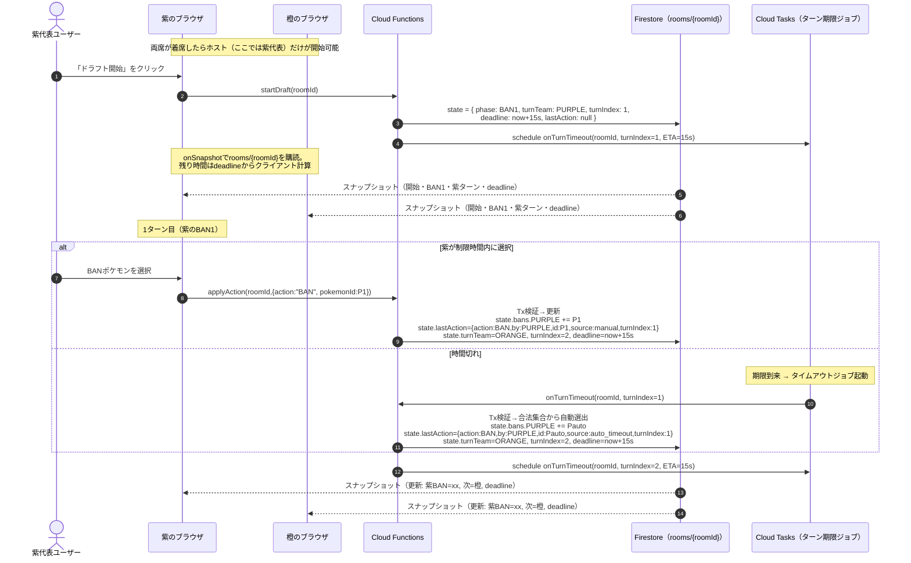

```mermaid
sequenceDiagram
    autonumber
    actor Purple as 紫代表ユーザー
    participant PurpleClient as 紫のブラウザ
    participant OrangeClient as 橙のブラウザ
    participant Func as Cloud Functions
    participant DB as Firestore（rooms/{roomId}）
    participant Tasks as Cloud Tasks（ターン期限ジョブ）

    Note over PurpleClient,OrangeClient: 両席が着席したらホスト（ここでは紫代表）だけが開始可能
    Purple->>PurpleClient: 「ドラフト開始」をクリック
    PurpleClient->>Func: startDraft(roomId)
    Func->>DB: state = { phase: BAN1, turnTeam: PURPLE, turnIndex: 1,<br />                          deadline: now+15s, lastAction: null }
    Func->>Tasks: schedule onTurnTimeout(roomId, turnIndex=1, ETA=15s)
    Note over PurpleClient,OrangeClient: onSnapshotでrooms/{roomId}を購読。<br />残り時間はdeadlineからクライアント計算
    DB-->>PurpleClient: スナップショット（開始・BAN1・紫ターン・deadline）
    DB-->>OrangeClient: スナップショット（開始・BAN1・紫ターン・deadline）

    %% 1ターン目：紫のBAN1（時間切れ分岐あり）
    Note over PurpleClient: 1ターン目（紫のBAN1）
    alt 紫が制限時間内に選択
        Purple->>PurpleClient: BANポケモンを選択
        PurpleClient->>Func: applyAction(roomId,{action:"BAN", pokemonId:P1})
        Func->>DB: Tx検証→更新<br />state.bans.PURPLE += P1<br />state.lastAction={action:BAN,by:PURPLE,id:P1,source:manual,turnIndex:1}<br />state.turnTeam=ORANGE, turnIndex=2, deadline=now+15s
    else 時間切れ
        Note over Tasks: 期限到来 → タイムアウトジョブ起動
        Tasks->>Func: onTurnTimeout(roomId, turnIndex=1)
        Func->>DB: Tx検証→合法集合から自動選出<br />state.bans.PURPLE += Pauto<br />state.lastAction={action:BAN,by:PURPLE,id:Pauto,source:auto_timeout,turnIndex:1}<br />state.turnTeam=ORANGE, turnIndex=2, deadline=now+15s
    end
    Func->>Tasks: schedule onTurnTimeout(roomId, turnIndex=2, ETA=15s)
    DB-->>PurpleClient: スナップショット（更新: 紫BAN=xx, 次=橙, deadline）
    DB-->>OrangeClient: スナップショット（更新: 紫BAN=xx, 次=橙, deadline）

    %% 2ターン目：橙のBAN1（時間切れ分岐あり）
```
